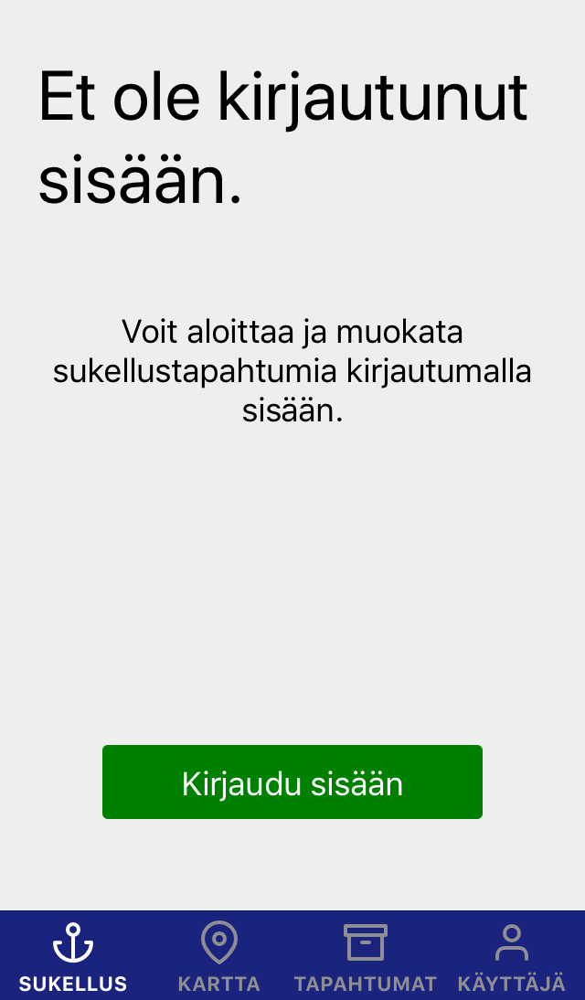

# sukeltaja-frontend documentation

## The basics

The purpose of Sukeltaja is to help divers in Finland organize and plan ahead dive events, act as a dive log book, and create more social interactions through social features of the app.

In Sukeltaja the user creates dive events (sukellustapahtuma) that they can invite their friends to. In the future administrators of dive clubs can also invite members to their own events.

Inside the dive events the users can check the event and target details, chat and dive. In the future users can share media about the diving events such as pictures and videos, check the weather conditions, possibly integrate dive computer data about the dives to Sukeltaja, etc.

Currently users don't have much in their profile. In the future users have a count of how many dives they have performed. In the future users can also belong to a dive club, choose their own profile picture, integrate their account with Sukeltajaliitto, etc.

## The user interface

The user interface is split into four different tabs visible in the bottom: Sukellus, Kartta, Tapahtumat and Käyttäjä.

### Logging in

Only the map screen can be used without logging in. Logging in, registering, and sending a forgotten password request happens on the user tab.

#### NoUserScreen.js

The screen that is shown when an action is not permitted due to user not being logged in.

### [ Sukellus (Dive)](https://github.com/Sukeltaja-App/sukeltaja-frontend/tree/master/src/components/OngoingEventScreens)

This tab was designed to have everything you would need to do when handling an ongoing event. Check the target or event details, modify event details if you are an admin, check weather, chat with participants, handle dives, etc...

#### StartEventScreen.js

This screen was designed to be the quickest and most convenient access to start diving. This screen should always strive to be as simplistic as possible with a minimal amount of clicks required to actually start diving.

**Possible new feature(s):**

- User should be able to pick an event here that is already in their events list: "Valitse tapahtuma".

#### TargetScreen.js

tbd

#### DiveScreen.js

tbd

#### ChatScreen.js

tbd

#### EventScreen.js

tbd

### [ Kartta (Map)](https://github.com/Sukeltaja-App/sukeltaja-frontend/tree/master/src/components/MapScreens)

The main purpose of the map is of course to assist in navigation, but the map could also be used in plenty of other ways. Here's a short list of what we came up with:

1. During an ongoing event, it could be possible to show all divers that are currently diving on the map. (social use!)
2. A diver could click a spot from the map to make a notification about a shipwreck (hylkyilmoitus) to Museovirasto.
3. A diver could click a spot from the map and create their own, new targets that would be private: visible only for them.

#### MapScreen.js

There's a search bar that narrows the visible map screen down whenever possible. Clicking on a cluster centers on the targets underneath. Clicking the bubble coming out of a map marker shows the target screen, where you can pick the chosen target to be the target of the ongoing event. Green map markers mean currently chosen target.

**Possible new feature(s):**

- User should be able to pick the chosen target to be the target of _any_ event.
- If a target has already been chosen for the ongoing event, zoom and center the camera on it.

### [ Tapahtumat (Events)](https://github.com/Sukeltaja-App/sukeltaja-frontend/tree/master/src/components/EventScreens)

tbd

#### [EventMenuScreen.js](https://github.com/Sukeltaja-App/sukeltaja-frontend/blob/master/src/components/EventScreens/EventMenuScreen.js)

tbd

#### [EventListScreen.js](https://github.com/Sukeltaja-App/sukeltaja-frontend/blob/master/src/components/EventScreens/EventListScreen.js)

tbd

### [ Käyttäjä (User)](https://github.com/Sukeltaja-App/sukeltaja-frontend/tree/master/src/components/ProfileScreens)

tbd

#### ProfileScreen.js

tbd

#### [InvitesScreen.js](https://github.com/Sukeltaja-App/sukeltaja-frontend/blob/master/src/components/ProfileScreens/InvitesScreen.js)

tbd

#### SettingsScreen.js

tbd