# sukeltaja-frontend documentation

This document serves as a design documentation of the user interface of Sukeltaja: what was intended, what succeeded or failed, and it lists some possible ideas for the future.

## The basics

The purpose of Sukeltaja is to help divers in Finland organize and plan ahead dive events, act as a dive log book, and create more social interactions through social features of the app.

In Sukeltaja the user creates dive events (sukellustapahtuma) that they can invite their friends to. In the future administrators of dive clubs can also invite members to their own events.

Inside the dive events the users can check the event and target details, chat and dive. In the future users can share media about the diving events such as pictures and videos, check the weather conditions, possibly integrate dive computer data to Sukeltaja, etc.

Currently users don't have much in their profile. In the future users have a count of how many dives they have performed. They can also belong to a dive club, choose their own profile picture, manage their account, integrate their account with Sukeltajaliitto, etc.

## The user interface

The user interface is split into four different tabs visible in the bottom: Sukellus, Kartta, Tapahtumat and Käyttäjä.

Only the map screen can be used without logging in. Logging in, registering, and sending a forgotten password request happens on the user tab.

### [ Sukellus (Dive)](https://github.com/Sukeltaja-App/sukeltaja-frontend/tree/master/src/components/OngoingEventScreens)

The Sukellus tab was designed to have everything you would need to do when handling an ongoing event. Check the target or event details, modify event details if you are an admin, check weather, chat with participants, handle dives, etc.

#### [StartEventScreen.js](https://github.com/Sukeltaja-App/sukeltaja-frontend/blob/master/src/components/OngoingEventScreens/StartEventScreen.js)

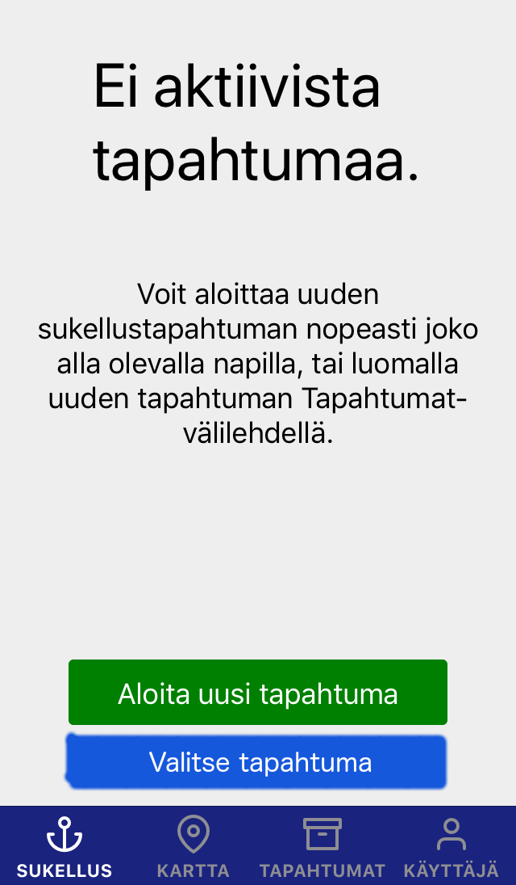

This screen was designed to always be the fastest and most convenient method to start diving. It should always strive to be as simplistic as possible with a minimal amount of clicks required to "just get into the action".

**Possible new feature(s):**

- User should be able to pick an event here from their events list, e.g. "Valitse tapahtuma".

#### [TargetScreen.js](https://github.com/Sukeltaja-App/sukeltaja-frontend/blob/master/src/components/OngoingEventScreens/OngoingEventTabs/TargetScreen.js)

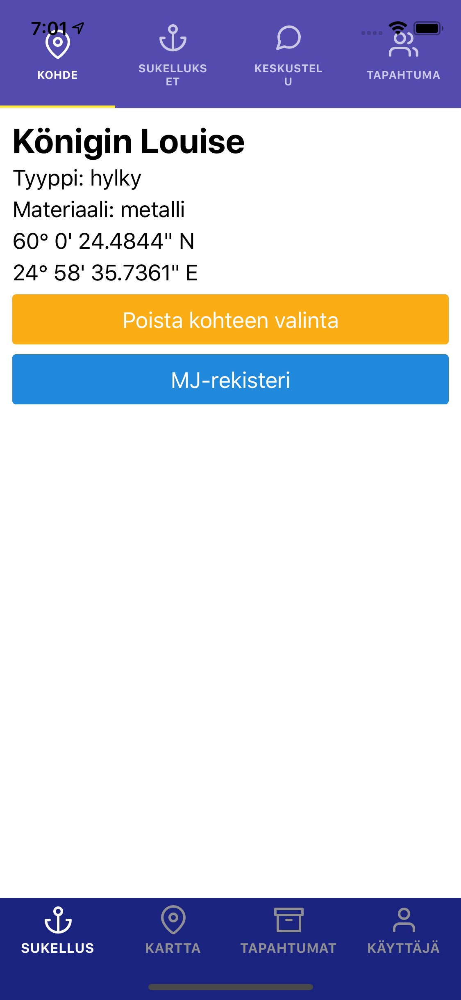

When an event is ongoing, this screen was designed to have details about the dive target, such as the name of the target, depth, weather conditions, etc.

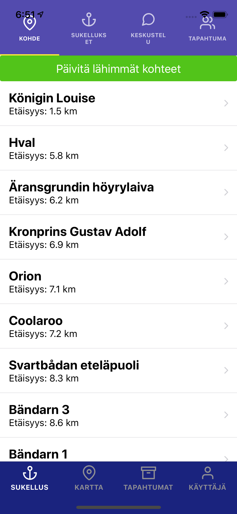

If no target has been selected, user is given a list of closest targets (currently max 10).

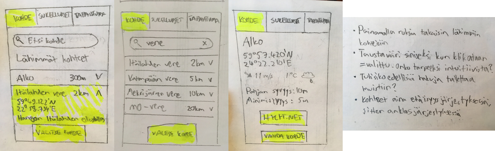

The original design had the closest targets as a list with a dropdown button to see details of each target. There is a search bar at the top to search from the list of all targets known. If the 'x' in the search box is pressed, the user is again presented a list of closest targets.

**Possible new feature(s):**

- User should be able to search for a target by name from a list of all targets.

#### [DiveScreenStack](https://github.com/Sukeltaja-App/sukeltaja-frontend/tree/master/src/components/OngoingEventScreens/OngoingEventTabs/DiveScreenStack)

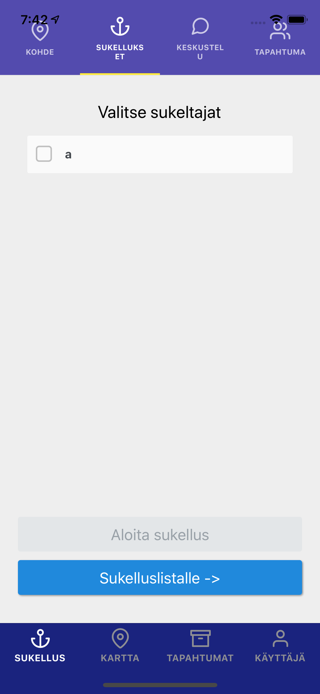

Sukellusvanhin ("the oldest diver", basically event admin) should be able to start dives here, and if it's a private event, the diver as well. If a diver is currently diving, the background of the diver should turn blue.

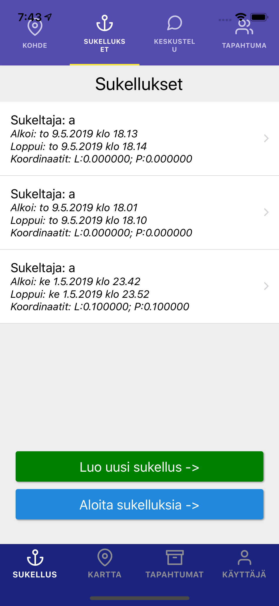

There's a list of previous dives here that you can edit.

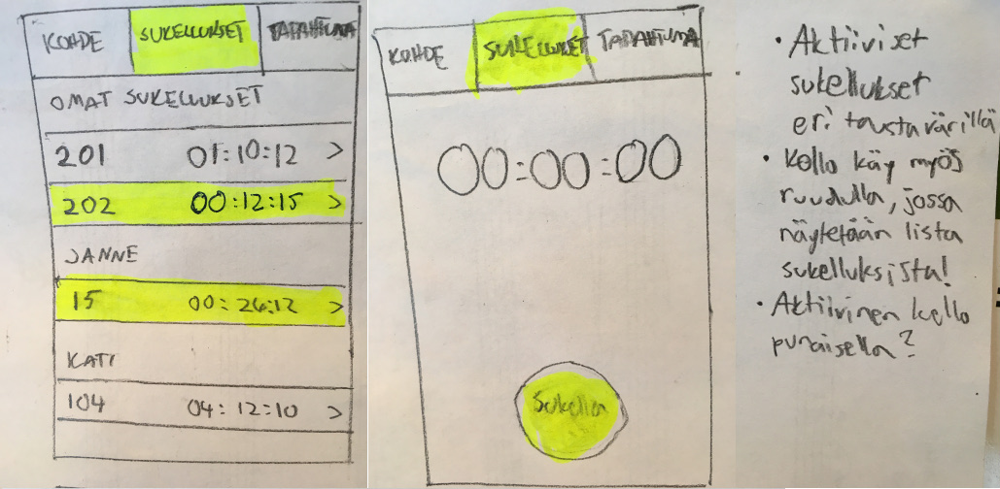

The original design was a bit different, with your own dives at the top. There's the dive number, names of the divers and timers. Active dives would have a different background color and the timer colored red.

**Possible new feature(s):**

- The dive screens could be prettier and easier to navigate.

#### [ChatScreen.js](https://github.com/Sukeltaja-App/sukeltaja-frontend/blob/master/src/components/OngoingEventScreens/OngoingEventTabs/ChatScreen.js)

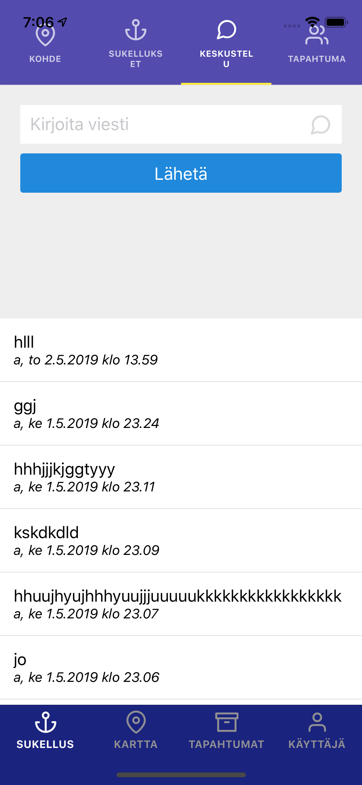

Just a normal chat screen for divers to chat about the event. Due to time constraints, the message box is in the upper part of the screen and new messages appear on top, which probably isn't intuitive at all.

There is a React Native component called [KeyboardAvoidingView](https://facebook.github.io/react-native/docs/keyboardavoidingview) that could be used to create a more "traditional" chat screen, however it's not that clear how KeyboardAvoidingView works together with [ScrollView](https://facebook.github.io/react-native/docs/scrollview), which is something we didn't have time to investigate.

**Possible new feature(s):**

- Make the chat screen behave more like a "traditional" chat with the message box at the bottom and new messages appearing on bottom as well.

#### [EventScreen.js](https://github.com/Sukeltaja-App/sukeltaja-frontend/blob/master/src/components/OngoingEventScreens/OngoingEventTabs/EventScreen.js)

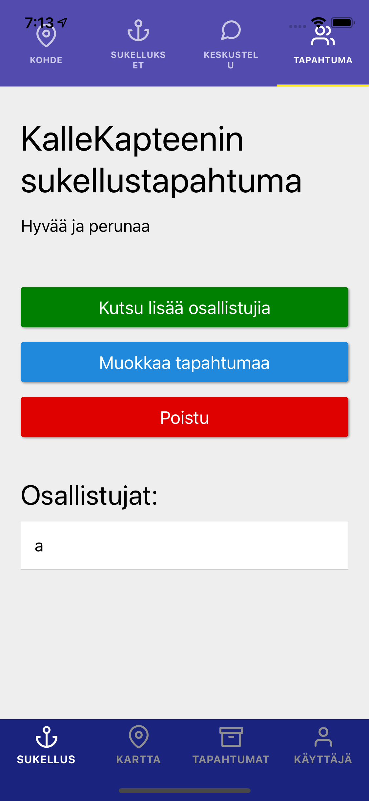

This screen has information about the dive event: there's the event title, description, and a list of participants. Also links to invite new participants or to edit the event in a new screen.

**Possible new feature(s):**

- Make the title and the description (possibly other things as well) editable for an admin of the event directly from this screen.

### [ Kartta (Map)](https://github.com/Sukeltaja-App/sukeltaja-frontend/tree/master/src/components/MapScreens)

The main purpose of the map is of course to assist in navigation, but the map could also be used in plenty of other ways. Here's a short list of what we came up with:

1. During an ongoing event, it could be possible to show all divers that are currently diving on the map. (social use!)
2. A diver could click a spot from the map to make a notification about a shipwreck (hylkyilmoitus) to Museovirasto.
3. A diver could click a spot from the map and create their own new targets that would be private, i.e. visible only for them.

The map was developed using [react-native-maps-super-cluster](https://github.com/novalabio/react-native-maps-super-cluster).

#### [MapScreen.js](https://github.com/Sukeltaja-App/sukeltaja-frontend/blob/master/src/components/MapScreens/MapScreen.js)

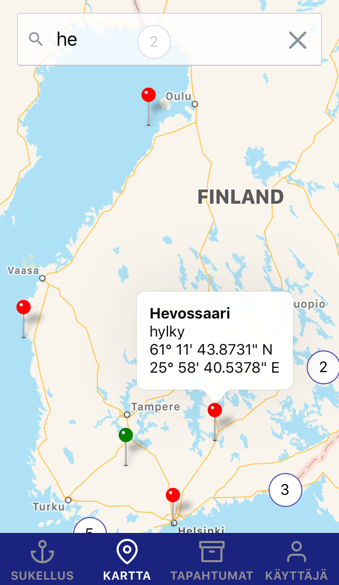

There's a search bar that narrows the visible map screen whenever possible. Clicking on a cluster centers on the targets underneath. Clicking the bubble coming out of a map marker shows the target screen, where you can pick the marked target to become the target of the ongoing event. Green map markers indicate currently chosen target.

**Possible new feature(s):**

- User should be able to pick the chosen target to be the target of _any_ event.
- If a target has already been chosen for the ongoing event, zoom and center the camera on it.

### [ Tapahtumat (Events)](https://github.com/Sukeltaja-App/sukeltaja-frontend/tree/master/src/components/EventScreens/EventMenuStack)

This tab was designed to be like a more general menu. As of now it only has menus dealing with events, hence the name "Tapahtumat". However one could design other things to be added here in the future as well.

#### [EventMenuScreen.js](https://github.com/Sukeltaja-App/sukeltaja-frontend/tree/master/src/components/EventScreens/EventMenuStack/EventMenuScreen.js)

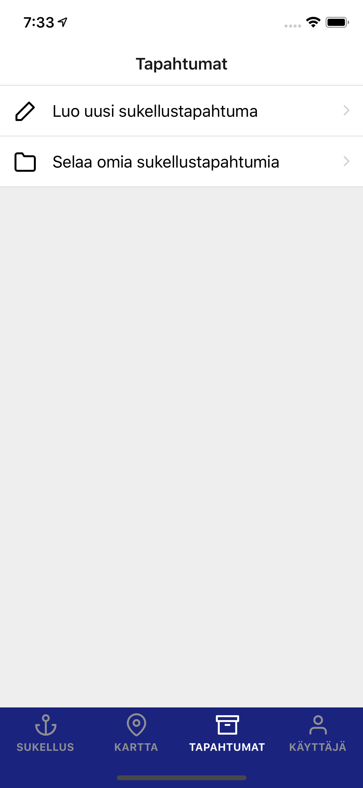

Just a basic menu. There used to be a button to join an event directly here ("Liity sukellustapahtumaan"), which could be used to join an event your friends or your dive club has created. Right now you just receive event invitations to your profile tab.

#### [EventListScreen.js](https://github.com/Sukeltaja-App/sukeltaja-frontend/tree/master/src/components/EventScreens/EventMenuStack/EventListScreen.js)

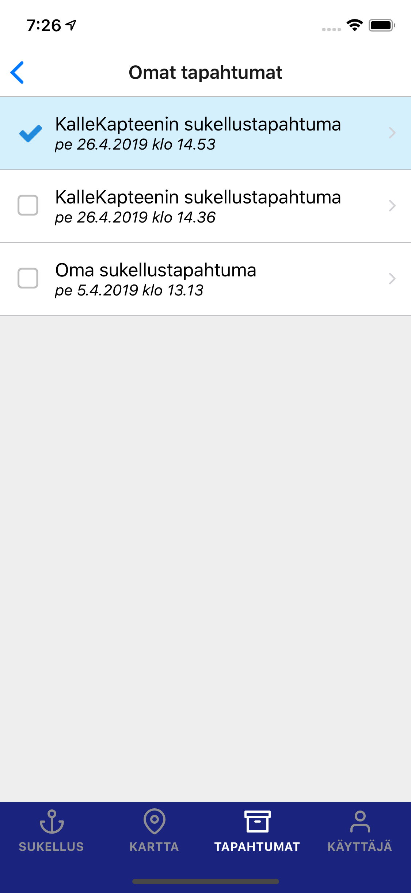

This is a list of all the events the user is in. Clicking on an event goes to the event screen where you can edit or delete the event. Changing an ongoing event (an event that is displayed in the "Sukellus" tab) happens here as well. An ongoing event has a blue background. Clicking on a checkbox switches the ongoing event to be that event.

This is probably not the most intuitive way to change the ongoing event. It would be better at least to be able to choose the ongoing event from the "Sukellus" tab itself ("Valitse tapahtuma").

### [ Käyttäjä (User)](https://github.com/Sukeltaja-App/sukeltaja-frontend/tree/master/src/components/ProfileScreens/ProfileTabs)

In this tab the user can see and edit information about their profile and settings.

#### [ProfileScreen.js](https://github.com/Sukeltaja-App/sukeltaja-frontend/blob/master/src/components/ProfileScreens/ProfileTabs/ProfileScreen.js)

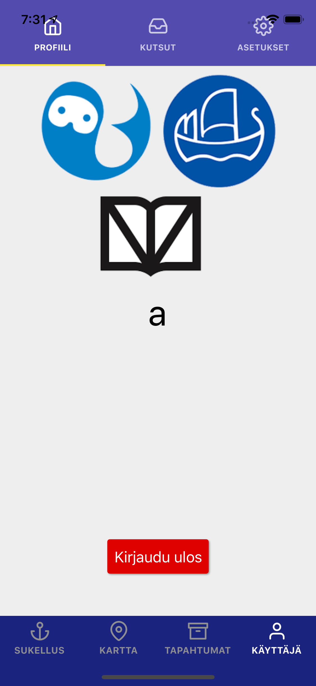

Nothing special, there could be a profile picture here and a way to change password, username, and so on. Maybe add the number of dives you've done, your dive club, etc.

#### [InvitesScreen.js](https://github.com/Sukeltaja-App/sukeltaja-frontend/blob/master/src/components/ProfileScreens/ProfileTabs/InvitesScreen.js)

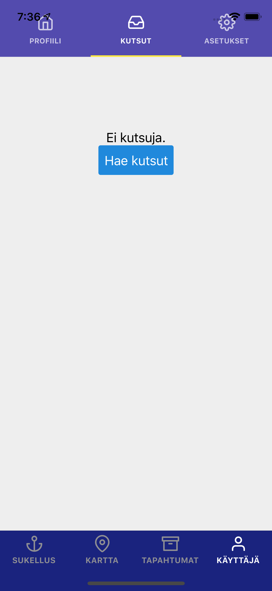

Self-explanatory. The button should not be needed anymore due to WebSockets handling user invitations, however for now it was left to still be there.

#### [SettingsScreen.js](https://github.com/Sukeltaja-App/sukeltaja-frontend/blob/master/src/components/ProfileScreens/ProfileTabs/SettingsScreen.js)

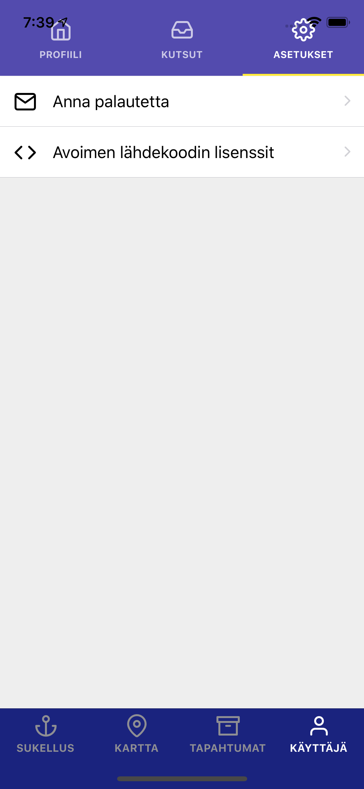

Self-explanatory. Not much settings here yet.
